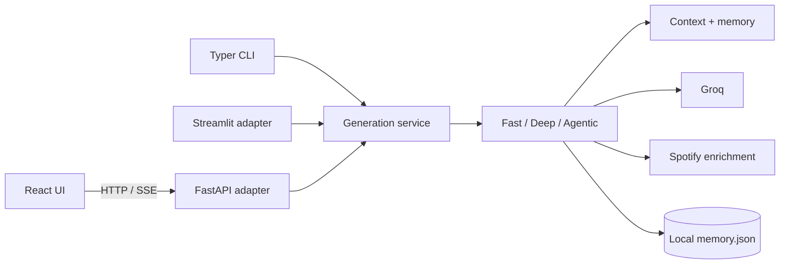
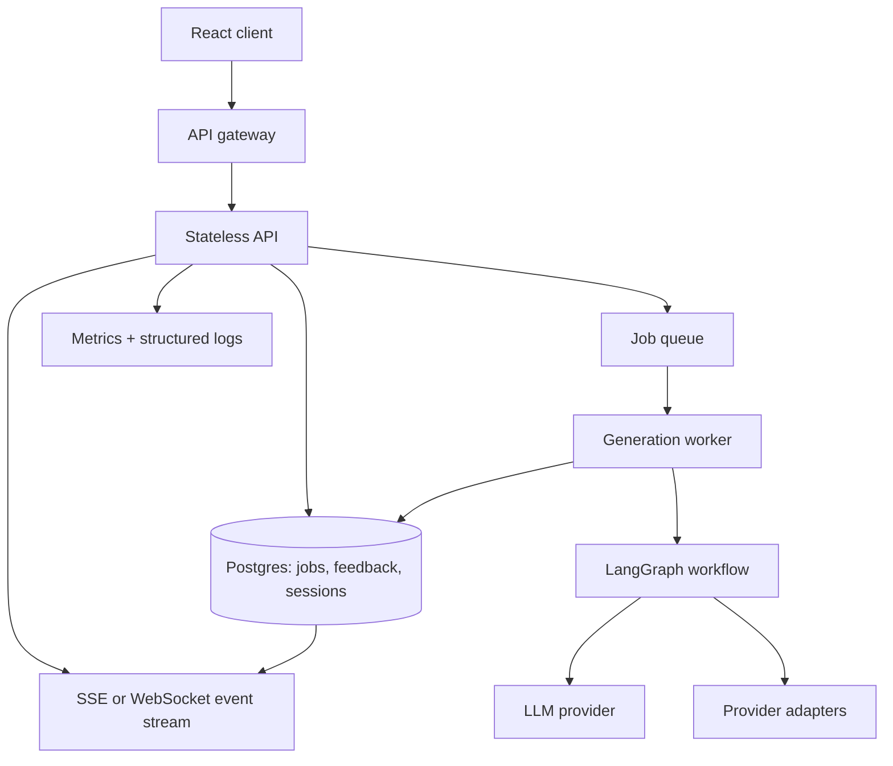

# VibeForge System Design

## Goals

- Keep playlist generation predictable at the boundaries even though the LLM is probabilistic.
- Isolate transport concerns from generation policy and agent orchestration.
- Make failures observable and recoverable without exposing provider or filesystem details to clients.
- Preserve a fast local developer experience while leaving a clear path to asynchronous jobs.

## Current runtime flow

The application service is the policy boundary. It validates and normalizes a generation request, selects the pipeline, and keeps adapters from duplicating mode-selection logic. The LangGraph pipeline remains the orchestration boundary for agentic generation.

## Production target

### Boundaries and responsibilities

| Boundary | Responsibility | Reliability rule |
|---|---|---|
| API adapter | Authentication, rate limits, request/response schemas, correlation IDs | Never contain pipeline selection logic |
| Generation service | Validate input, select mode, define the use-case contract | No HTTP, Streamlit, or CLI imports |
| LangGraph workflow | Mood analysis, curation, critique, refinement | Bounded retries and explicit terminal state |
| Provider adapters | Groq, Spotify, weather | Timeouts, retry budgets, circuit breaking, redacted errors |
| Repository layer | Sessions, feedback, job state | Atomic writes locally; transactional writes in production |
| Worker | Async execution and event publication | Idempotency key per generation request |

## Key design decisions

1. **Request IDs and idempotency:** every generation receives a correlation ID; production POST requests accept an idempotency key so client retries do not create duplicate jobs.
2. **Explicit lifecycle:** `queued -> running -> succeeded | failed | cancelled`. Events include `job_id`, `sequence`, `type`, and a timestamp so reconnecting clients can resume safely.
3. **Provider isolation:** LLM and Spotify calls should sit behind interfaces with bounded timeouts. A Spotify outage should degrade to search URLs, while an LLM outage should produce a typed failure and a retryable job state.
4. **Persistence migration:** `memory.json` is suitable for a single local user only. Use SQLite for local multi-process use, then Postgres for deployed environments. Keep the preference repository interface stable across that migration.
5. **Security:** do not return raw exception strings from API responses, validate model names server-side, cap input sizes, configure CORS from environment, and keep provider secrets server-side.
6. **Evaluation:** record pipeline mode, model, latency, retry count, critic score, and validation failures. Store prompt/model versions with each job to make playlist quality debuggable.

## Delivery sequence

1. Establish the service and typed API contract (this change).
2. Add health/readiness endpoints, structured request IDs, and focused contract tests.
3. Introduce repository interfaces and SQLite-backed persistence for local concurrency.
4. Move generation into a worker queue and persist lifecycle events.
5. Add metrics, tracing, rate limiting, authentication, and LLM quality evaluation gates.